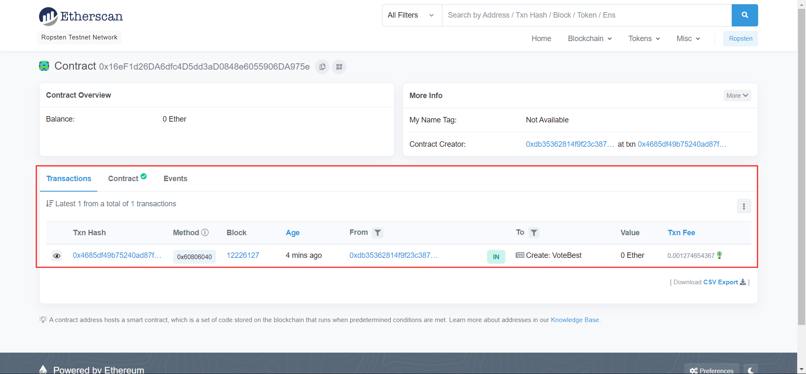
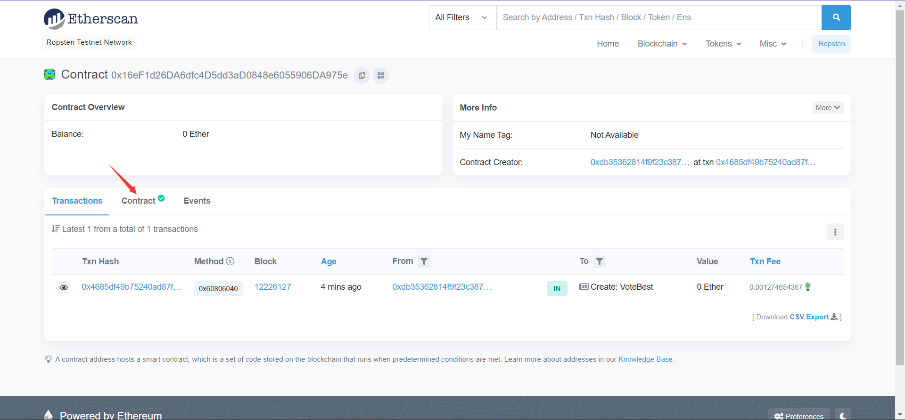
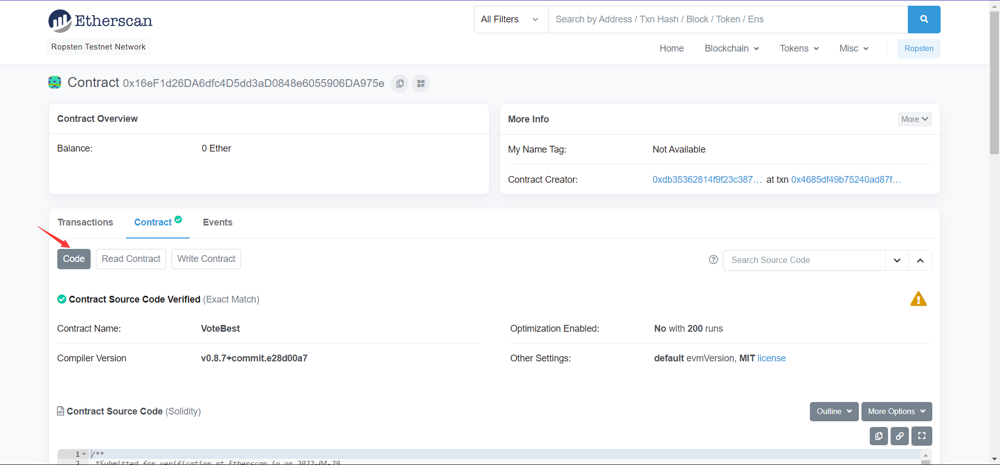
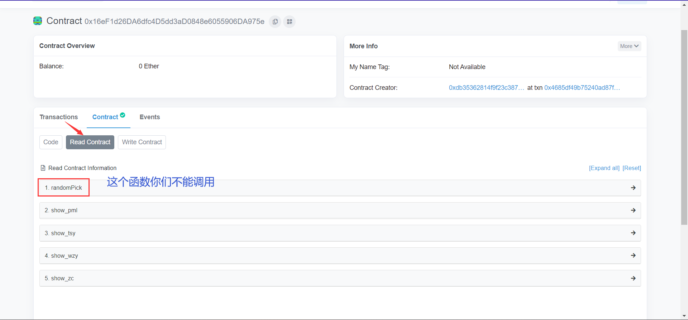
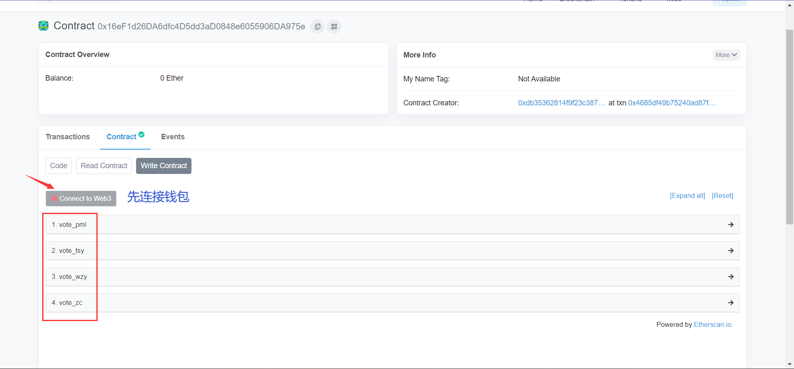
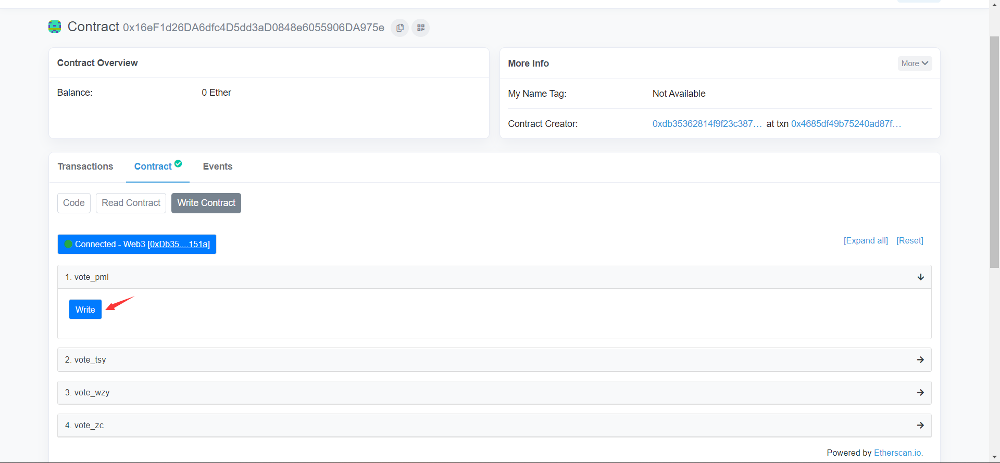

# 16组最后一次作业优秀组员投票

链上合约投票，绝对匿名、公开、透明。

## 1.领取测试币

（如果你账户里的余额足够，可以跳过此步）

因为与合约交互投票需要消耗gas，所以你的meta mask账户里必须有一定的测试币。

faucet网址：https://faucet.egorfine.com/

（当然水龙头网址有很多，可以自己Google）

## 2.进入区块链浏览器

点击网址：https://ropsten.etherscan.io/address/0x16ef1d26da6dfc4d5dd3ad0848e6055906da975e

打开后进入合约界面

`Transactions` 模块下展示的是与该合约有关的所有交易，如果有人投了票，可以看到投票那笔交易的信息。

## 3.进入Contract页面

在该页面下，你可以看到合约的代码和相关函数

`Code` 下是开源的合约代码

### Read Contract

这里用来查看每个人的得票数，都是 `view` 函数类型，不用连接钱包，不需要gas

（注：第一个函数我加了权限，你们不能调用，如果最终有平手，我再调用这个`randomPick`来随机选择）

### Write Contract

这里是投票的界面，这四个函数分别对应你们4个人，调用一次函数就对应加一票（注：我设置了每个地址只能投一次）。在调用函数前，你需要先点击“Connect to Web3”连接自己的Meta Mask钱包。

连接成功后，选择你想调用的函数，点击 `Write` ，这时Meta Mask会弹出让你签名并支付gas，交易成功即投票成功。

## End

大家尽快投票，我在截止日期前1天统计公布结果，这次只选一名优秀组员。
